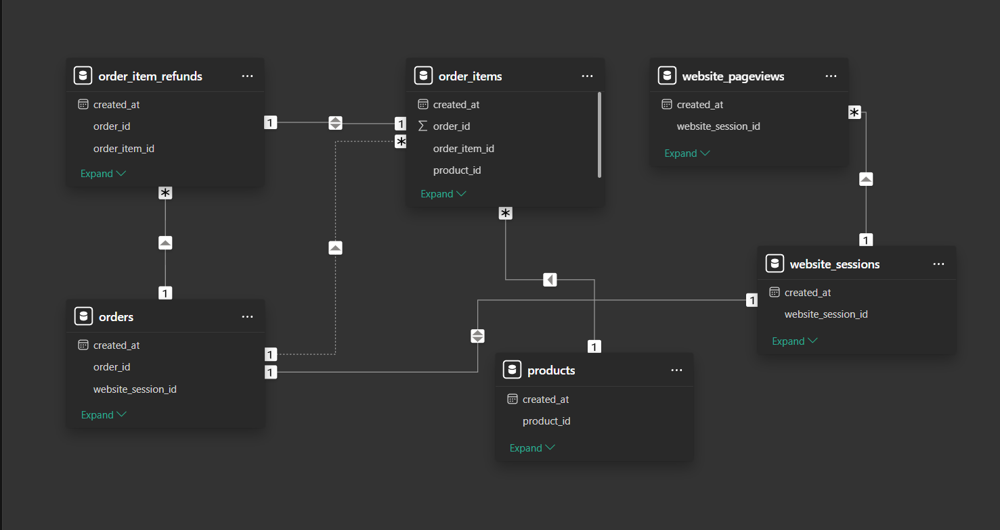
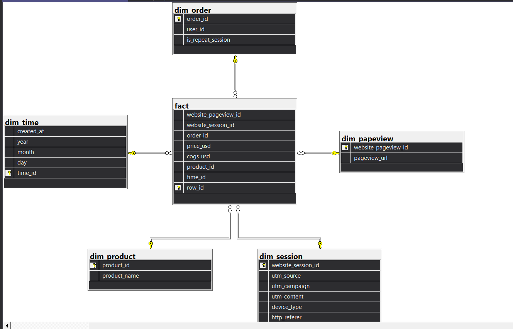

# Toy Store E-Commerce Analytics Platform

A **data warehousing and analytics platform** for a fictional toy store e-commerce business ("Maven Fuzzy Factory"). This project ingests raw transactional data, loads it into SQL Server, transforms it into a star-schema data warehouse via SSIS, performs exploratory data analysis using Python, and builds OLAP cubes via SSAS for multidimensional analysis.

## Architecture

```
[CSV Files] ──► [SQL Server OLTP: toy_store_database]
                       │
                       ▼
            [SSIS ETL Packages]
                       │
                       ▼
   [SQL Server Data Warehouse: toy_store_datawarehouse]
        (Star Schema: fact + dimension tables)
                    ┌──┴──┐
                    ▼     ▼
            [SSAS Cube]  [Python/Jupyter]
                    │         │
                    ▼         ▼
              [Power BI]  [EDA / ML / Reports]
```

- **Source Layer**: Raw CSV files from Maven Analytics Data Playground
- **Staging Area**: SQL Server OLTP database (`toy_store_database`)
- **Data Warehouse**: SQL Server star-schema (`toy_store_datawarehouse`)
- **ETL Middleware**: SSIS packages (4 projects)
- **OLAP**: SQL Server Analysis Services (SSAS) multidimensional cube
- **Consumption Layer**: Python/Jupyter notebooks for EDA & ML, Power BI for dashboards

## Tech Stack

| Category | Technologies |
|---|---|
| Languages | Python 3.12, T-SQL, XML (SSIS), MDX (SSAS) |
| Database | Microsoft SQL Server 2022 (`LENOVO\SQLEXPRESS`) |
| ETL | SQL Server Integration Services (SSIS) — Visual Studio 2022 / SSDT |
| OLAP | SQL Server Analysis Services (SSAS) — Multidimensional (MOLAP) |
| Analysis & ML | Jupyter Notebook, pandas, numpy, matplotlib, seaborn, scikit-learn |
| BI | Microsoft Power BI |
| Source Data | [Maven Analytics — Toy Store E-Commerce Database](https://mavenanalytics.io/data-playground/toy-store-e-commerce-database) |

## Data Source

Raw data comes from the **Maven Analytics Data Playground**. It contains ~3 years of e-commerce data (Mar 2012 – Apr 2015) for a fictional toy store:

| Dataset | Records | Description |
|---|---|---|
| `website_sessions` | 472,871 | Web traffic with UTM marketing params |
| `website_pageviews` | 1,188,124 | Individual pageview logs |
| `orders` | 32,313 | Order headers |
| `order_items` | 40,025 | Line items per order |
| `order_item_refunds` | 1,731 | Refund records |
| `products` | 4 | Product catalog |

## Data Model

### OLTP — Normalized Schema



### Data Warehouse — Star Schema



## Project Structure

```
├── data/
│   ├── raw/              # Source CSV files (6 datasets)
│   └── processed/        # ETL outputs: star-schema CSV files
├── database/
│   ├── schema/           # OLTP database schema (T-SQL)
│   └── warehouse/        # DW schema + SSIS & SSAS projects
│       ├── etl/                          # Excel → stage (legacy)
│       ├── etl_toy_store/                # OLTP → staging
│       ├── etl_toy_store_dataware_house/ # Staging → DW star schema
│       ├── mds/                          # SSAS multidimensional cube
│       └── test/                         # Test SSIS package
├── notebooks/
│   └── 01_information_data.ipynb         # Initial EDA
├── ml/
│   ├── notebooks/
│   │   └── 01_create_ml_dataset.ipynb   # ML dataset creation
│   ├── models/          # Trained models (empty)
│   └── src/             # ML source code (empty)
├── reports/
│   ├── dashboard/       # Dashboard placeholder
│   ├── data/
│   │   ├── schema.png       # OLTP schema diagram
│   │   └── star_schema.png  # Star schema diagram
│   └── words/de_cuong.docx  # Project outline (Vietnamese)
├── docs/
│   └── note.md           # Reference notes
├── powerbi/              # Power BI dashboard files (placeholder)
├── requirements.txt
├── .gitignore
└── LICENSE               # MIT
```

## Setup

### Prerequisites

- Microsoft SQL Server 2022 (local instance recommended)
- Visual Studio 2022 with SSIS installed
- Python 3.12+
- Git

### 1. Database Setup

```sql
-- Create OLTP database and import CSV data, then run:
database\schema\setup_database_schema.sql

-- Create data warehouse:
database\warehouse\setup_data_warehouse_schema.sql
```

### 2. SSIS ETL

Open the `.dtproj` files in Visual Studio under `database/warehouse/` and execute in order:

1. `etl_toy_store` — merges sessions + pageviews into staging
2. `etl_toy_store_dataware_house` — builds DW dimensions + fact table

### 3. Python Environment

```bash
python -m venv venv
source venv/bin/activate    # Linux/macOS
.\venv\Scripts\Activate.ps1 # Windows
pip install pandas numpy matplotlib seaborn jupyter
```

### 4. Run Notebooks

```bash
jupyter notebook notebooks/
```

## Usage

- **EDA**: Run `notebooks/01_information_data.ipynb` for initial data exploration
- **Marketing Analytics**: Analyze traffic sources, conversion rates, and campaign performance
- **Product Analytics**: Track product-level revenue, refund rates, and order patterns
- **Machine Learning**: Run `ml/notebooks/01_create_ml_dataset.ipynb` for feature engineering & model training
- **OLAP Analysis**: Process the SSAS cube in `database/warehouse/mds/` for multidimensional analysis
- **Dashboard**: Build Power BI reports in `powerbi/`

## Results

- **Data Quality**: All datasets are clean — no nulls or duplicates in most tables
- **Traffic Analysis**: ~83K nulls in `website_sessions.utm_*` fields (expected for direct/organic traffic)
- **Business Scale**: 4 products, 32K+ orders, 40K+ order items, 1.1M+ pageviews over ~3 years (Mar 2012 – Apr 2015)
- **OLTP**: Fully normalized schema with 6 tables, PK/FK constraints
- **Data Warehouse**: Star schema with 1 fact table (fact) and 5 dimension tables (dim_time, dim_session, dim_product, dim_order, dim_papeview)
- **SSAS Cube**: Multidimensional OLAP cube defined with 5 dimensions and 6 measure groups (unprocessed)
- **ETL Pipeline**: 3 SSIS packages handle end-to-end data flow from raw CSVs → OLTP → staging → DW

## License

MIT License — see [LICENSE](LICENSE). Copyright (c) 2026 Phan Trong Nguyen.
